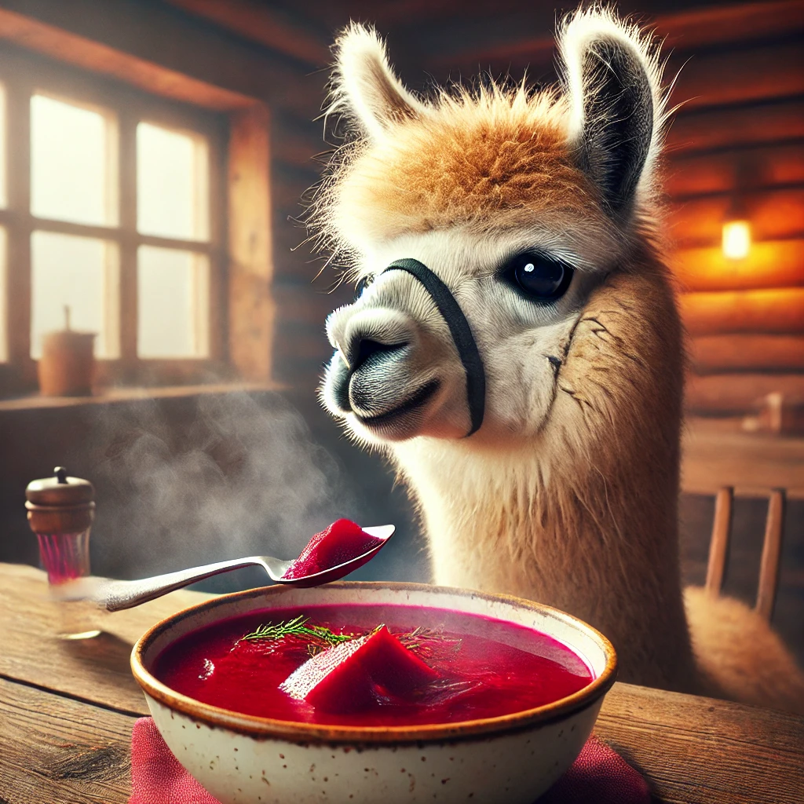

# What are Foundation Models Cooking in the Post-Soviet World? 

  

This repository contains food dishes and images of the BORSch dataset. In our paper ["What are Foundation Models Cooking in the Post-Soviet World?"](arxiv.org), we used this dataset to explore Post-Soviet cultural understanding in Russian and Ukrainian models.

## Dataset Structure
The data is split into three sub-datasets:
1. RU (Russian): Dishes collected in the Russian language. This data comes with name, country of origin, and source (wikidata/bootstrapping).
2. UK (Ukrainian): Dishes collected in the Ukrainian language. This data comes with name, country of origin, and source (wikidata/bootstrapping).
3. PARALLEL (Russian/Ukrainian): This is the parallel version of the above two corpuses. **Only dishes from Post-Soviet countries are included**.

Each dish has an ID (given in the ID column). This allows one to trace the dish to its image, in the images subfolder in the RU/UK datasets.

## Citation

`@misc{lavrouk2025foundationmodelscookingpostsoviet,
      title={What are Foundation Models Cooking in the Post-Soviet World?}, 
      author={Anton Lavrouk and Tarek Naous and Alan Ritter and Wei Xu},
      year={2025},
      eprint={2502.18583},
      archivePrefix={arXiv},
      primaryClass={cs.CL},
      url={https://arxiv.org/abs/2502.18583}, 
}`

## Contact

Anton Lavrouk: [Scholar](https://scholar.google.com/citations?user=Irpu0NAAAAAJ&hl=en) | [LinkedIn](https://www.linkedin.com/in/alavrouk) | [Personal Website](https://antonlavrouk.com/)
antonlavrouk \[AT\] google \[DOT\] com 

## Acknowledgments

The authors would like to thank Oleksandr Lavreniuk, Dennis Pozhidaev, and Jad Matthew Bardawil for their valuable discussion and annotation; Kartik Goyal for their valuable discussion.
